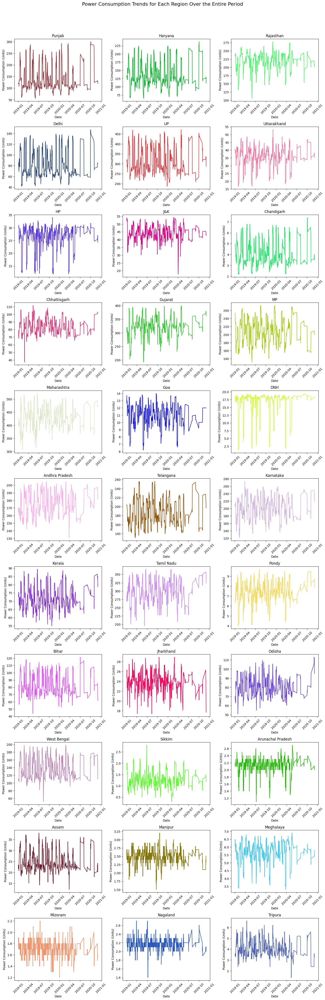

# Анализ потребления электроэнергии в регионах Индии в период с 2019 по 2021 год

# Цель проекта
Данный проект необходим для анализа потребление электроэнергии в регионах Индии для нахождения закономерностей, выбросов или аномалий

## Визуализация проведённого анализа
Ниже представлена визуализация данных потребления электроэнергии для каждого региона за весь период:

## Итоги анализа

### 1. Общие выводы по потреблению электроэнергии и выбросам
- В каждом регионе наблюдаются определенные колебания потребления электроэнергии.
- треть от всех предоставленных регионов имеют стабильное потребление электроэнергии, тогда как другие регионы демонстрируют резкие скачки.
- Периодические повторяющиеся тенденции могут указывать на влияние сезонных или внешних факторов на спрос на электроэнергию. Например, в большинстве регионов в периоде с ноября по март потребляется меньше электроэнергии, происходит минимальные выбросы, когда как **максимальные выбросы** наблюдались во время резких скачков потребления, что может быть связано с пиковыми нагрузками, особенно в летний сезон. Примеры таких регионов: **Maharashtra**, **Rajasthan**, и **Haryana**.

### 3. Значимые аномалии
Некоторые регионы демонстрировали выраженные аномалии, такие как резкие скачки и падения потребления:
- **Goa**: Временами наблюдаются очень низкие значения потребления, предположение что такова особенность инфраструктуры самого региона.
- **DNH**: Постоянное снижение потребления может также указывать на проблемы в инфраструктуре или погодные аномалии.
- **Karnataka**: регион показывает стабильное потребление, но встречаются редкие выбросы, указывающие на кратковременные аномальные явления.

### 4. Закономерности и тренды
- В таких регионах, как **Punjab**, **UP**, и **Haryana**, наблюдаются сезонные колебания потребления.
- **Синхронизированные пики и падения в разных регионах** могут быть связаны с общими погодными условиями или внешними факторами, такими как погодные условия, отключение электроэнергии и другие.

## Заключение
Для более глубокого анализа рекомендуется просмотр вычисленных данных в файле **Homework.ipynb**

Анализ был проведён при помощи таких инструментов:
- **Python**: Анализ и обработка данных.
- **Pandas**: Загрузка датасета из репозитория и вычислительная статистика.
- **NumPy**: Численные расчёты и выявления выбросов.
- **Matplotlib**: Визуализация, проведённого анализа.

